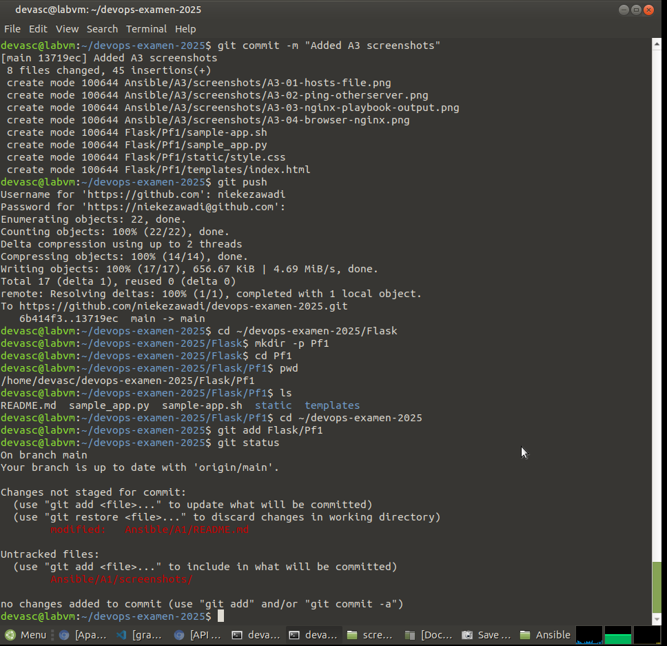
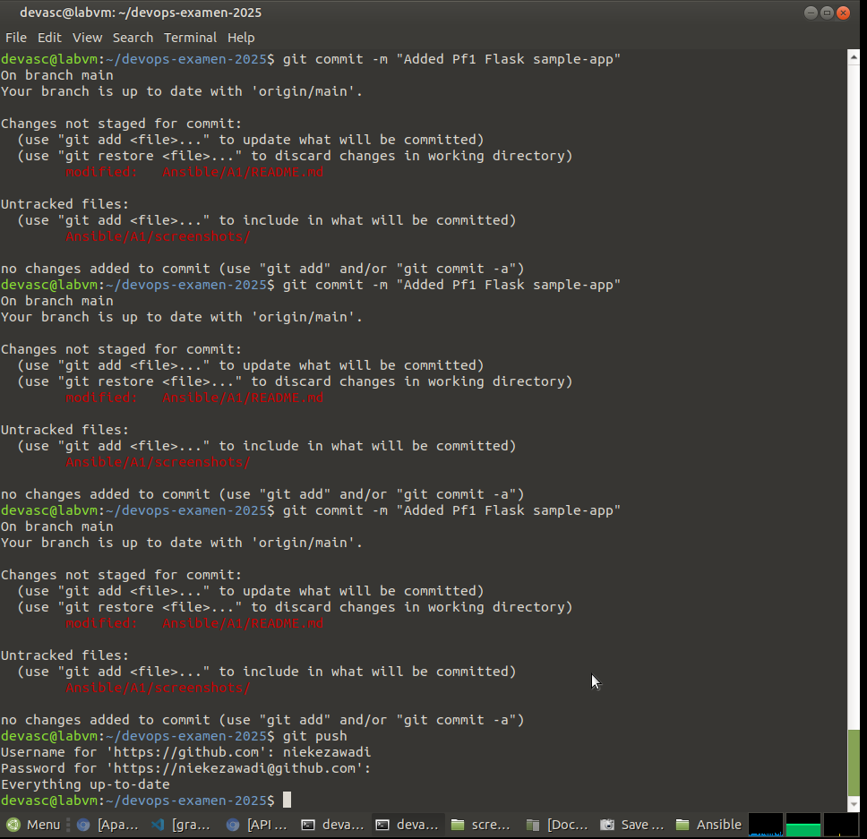
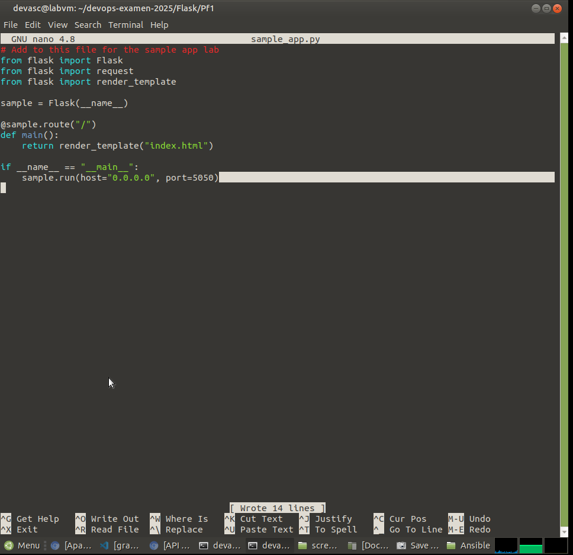
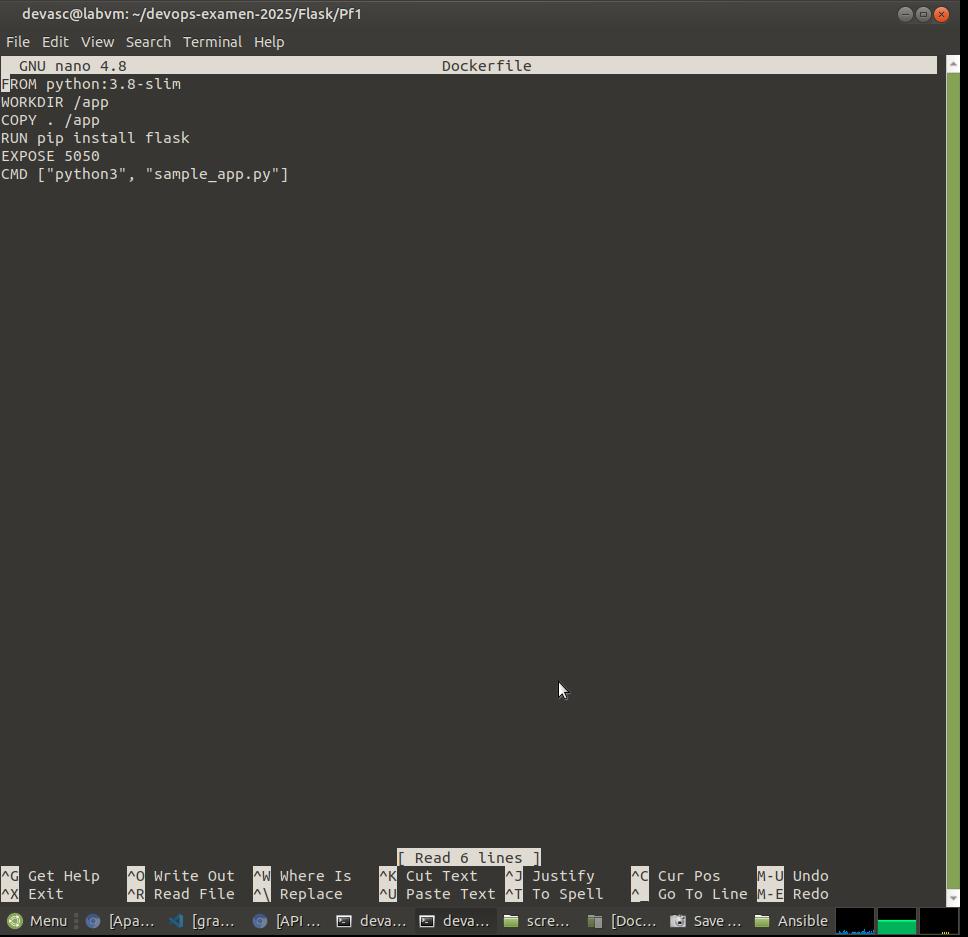
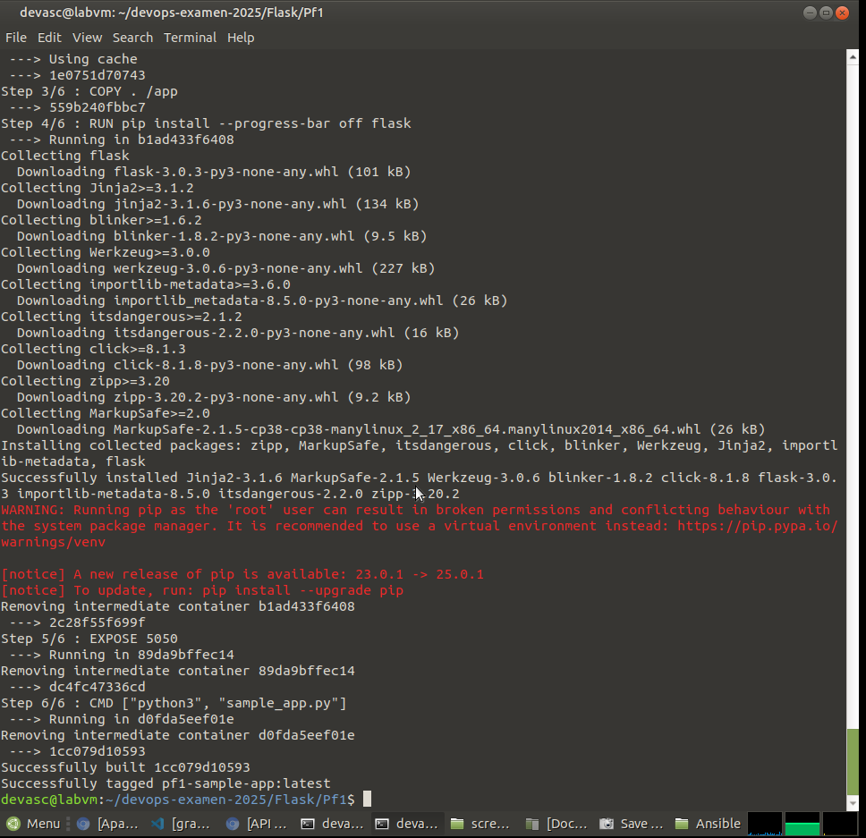
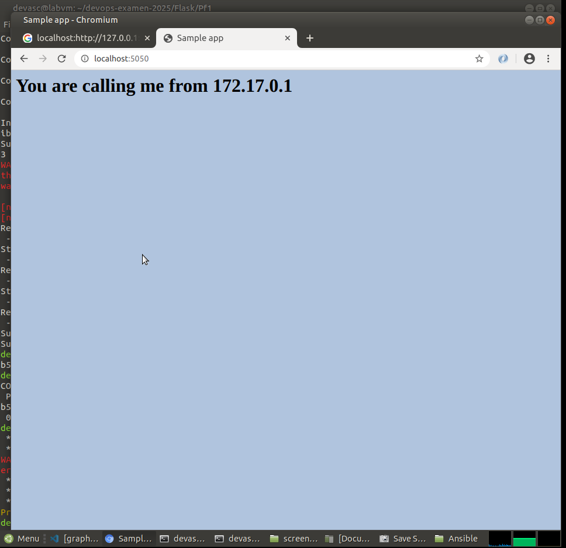

# Pf1 – Flask Sample App

Dit onderdeel demonstreert het deployen van een Flask-applicatie in Docker, inclusief het aanpassen van de poort en het bouwen van een Docker-image.

---

## Part 1 – Sample App voorbereiden

### Pf1-01 – Bewijs dat de sample-app in de juiste map staat

---

## Part 2 – Toevoegen aan Git repository

### Pf1-02 – Git status na toevoegen van Pf1

### Pf1-03 – Succesvolle commit en push

---

## Part 3 – Poort wijzigen en Docker build

### Pf1-04 – Aangepaste poort in sample_app.py (5050, threaded=False)

### Pf1-05 – Dockerfile met correcte inhoud

### Pf1-06 – Succesvolle Docker build

### Pf1-07 – Container draait op poort 5050

### Pf1-08 – Werkende Flask-pagina in browser

### Pf1-09 – Push van Part 3 naar GitHub

---

## Resultaat

- Flask-app draait op poort 5050  
- Docker-image succesvol gebouwd  
- Container succesvol gedeployed  
- Alle stappen gedocumenteerd met screenshots  
- Pf1 volledig klaar voor het examen

